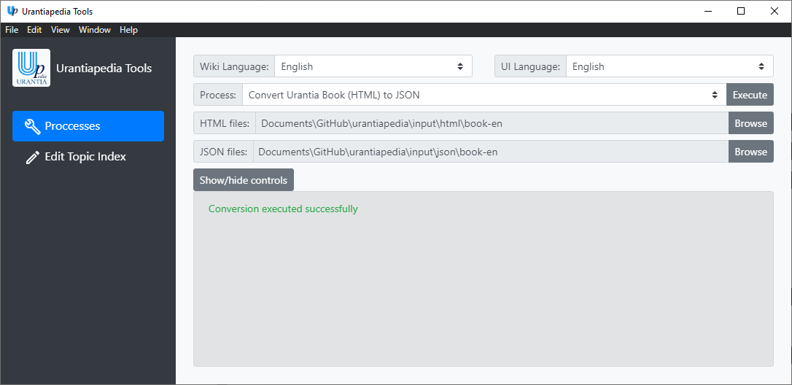
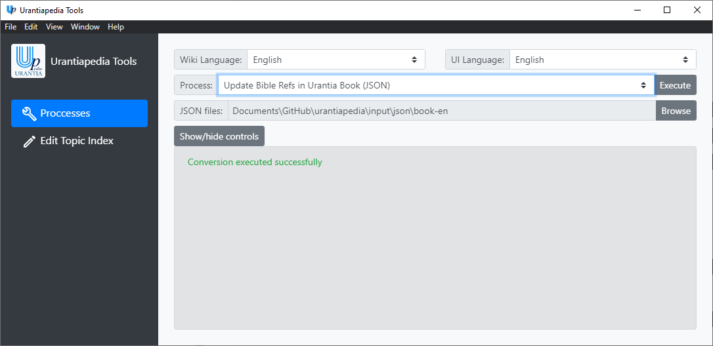
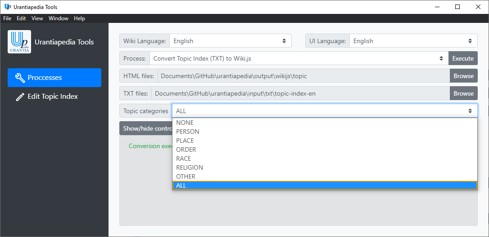
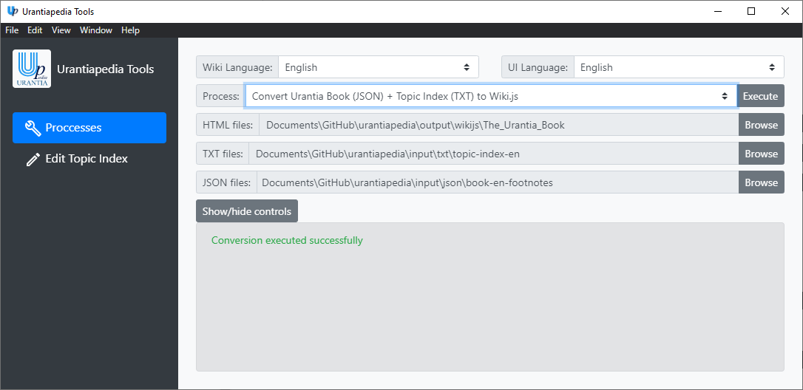

# Urantiapedia - Manual para «administradores»

## Acerca de la Urantiapedia

*Urantiapedia* (https://urantiapedia.site) es una web colaborativa basada en [*MediaWiki*](https://www.mediawiki.org/wiki/MediaWiki) con el propósito de servir de centro unificado de difusión de todo el conocimiento relativo a *El Libro de Urantia*.

---

## Acerca de Blue Fields

*Blue Fields* (https://blue-fields.netlify.app/) es una web que ha sido creada para unir y organizar a lectores de *El Libro de Urantia* que desean participar en proyectos inteligentes, propositados y altruistas en todo el mundo.

---

## Acerca de GitHub

El proyecto *Urantiapedia* en GitHub (https://github.com/JanHerca/urantiapedia) es un proyecto creado para servir de procedimiento rápido de creación inicial de la *Urantiapedia*. Contiene unos archivos en ciertos formatos y un software que ayudan a automatizar la creación de un contenido inicial.

---

## A quién va dirigido este manual

Este manual va dirigido a los usuarios denominados «administradores», es decir, aquellos usuarios que cumplen los siguientes requisitos:
- son usuarios registrados con una cuenta en [Blue Fields](https://blue-fields.netlify.app/) y en [GitHub](https://github.com/).
- son usuarios que han sido autorizados como administradores del proyecto por el equipo que dirige el proyecto en la plataforma [Blue Fields](https://blue-fields.netlify.app/).
- son usuarios registrados con una cuenta en la página *Urantiapedia* (https://urantiapedia.site). Durante la fase de preparación del proyecto este registro sólo lo podrán hacer otros usuarios «administradores» ya existentes con una cuenta en *Urantiapedia*.
- son usuarios con amplios conocimientos de manejo de GitHub y *MediaWiki*.
- son usuarios con amplio conocimiento de *El Libro de Urantia* al menos en un idioma en los que está publicado, y preferiblemente con un buen nivel de la versión en inglés.
- desean colaborar de forma desinteresada en la incorporación de información relativa a *El Libro de Urantia* en la *Urantiapedia*.

Los «administradores» de la web son los únicos encargados de subir cambios a la web *Urantiapedia* para comprobar el resultado del trabajo durante la fase de preparación.

---

## Flujo de trabajo

Sobre las fases del proyecto, el procedimiento de trabajo, el contenido planificado para el proyecto y cómo está organizado consultar el [Manual para «editores GitHub»](https://github.com/JanHerca/urantiapedia/blob/master/docs/HOWTO_github_editors.md)

La lista de tareas a realizar es la siguiente:
1. Traducción del *Paramony* del inglés al idioma de destino.
2. Traducción y revisión del *Índice de términos* del inglés al idioma de destino.
3. Obtención de una traducción de *La Biblia* en el idioma de destino.
4. Conversión de *El Libro de Urantia* de HTML a JSON sin notas al pie.
5. Adición de notas al pie a *El Libro de Urantia* en JSON.
6. Conversión del *Índice de términos* de TXT a Wikitext.
7. Conversión de *El Libro de Urantia* de JSON con notas al pie a Wikitext incluyendo referencias a los términos.
8. Conversión de *La Biblia* de LaTeX a Wikitext con notas al pie.

Los «editores GitHub» realizarán las tareas 1 a 3. Los «administradores» se encargan de las tareas 4 a 8. Pasamos a detallar cada tarea de los «administradores» en las secciones siguientes.

---

## Conversión de *El Libro de Urantia* de HTML a JSON sin notas al pie

Los ficheros de entrada en formato HTML deberán estar en las carpetas `input/html/book-xx`, donde `xx` son las dos letras del idioma (`es` = español, `en` = inglés, etc.)

> IMPORTANTE: Los ficheros HTML tal cual descargados de la web oficial de la [Fundación Urantia](https://www.urantia.org/urantia-book/download-text-urantia-book) pueden tener algunos problemas para ser procesados tal cual y resulte necesario introducir pequeñas modificaciones para ayudar en el proceso de conversión al formato JSON.

Una vez descargados los archivos de la web de la *Fundación Urantia* debería existir un archivo (*.html) por cada documento de *El Libro de Urantia*, en total 197 archivos. El nombre de cada archivo con cada documento debe cumplir el patrón de que los últimos tres caracteres del nombre sean el número del documento, desde 000 a 196 para que la conversión luego funcione. Por ejemplo, en francés el fichero con el documento 1 se llama `06-Fascicule001.html`; el mismo fichero en búlgaro se llama `06-Документ001.html`.

Puesto que en formato HTML *El Libro de Urantia* puede adoptar diferentes etiquetas HTML para lo que se considera el título del documento, el título de una sección, etc., en el programa que realiza la conversión quizá sea necesario incluir algunas modificaciones cuando se incorpore un nuevo idioma. Este trabajo correrá a cargo de los usuarios «desarrolladores», que son los usuarios que están a cargo del desarrollo de las *Urantiapedia Tools*. Este software está desarrollado en Javascript y el código se encuentra en la carpeta `app` del proyecto.

Actualmente están disponibles los archivos para 24 idiomas: búlgaro (`book-bg`), checo (`book-cs`), danés (`book-da`), alemán (`book-de`), griego (`book-el`), inglés (`book-en`), español (`book-es`, `book-es-1993` y en breve `book-es-2021`), estonio (`book-et`), farsi (`book-fa`), finlandés (`book-fi`), francés (`book-fr`), hebreo (`book-he`), húngaro (`book-hu`), indonesio (`book-id`), italiano (`book-it`), japonés (`book-ja`), coreano (`book-ko`), lituano (`book-lt`), holandés (`book-nl`), polaco (`book-pl`), portugués (`book-pt`), rumano (`book-ro`), ruso (`book-ru`) y sueco (`book-sv`). Estos archivos ya han sido modificados y procesados para que el programa de conversión a JSON funcione correctamente con ellos, y también están disponibles los ficheros JSON resultantes.

La traducción al farsi está actualmente en proceso y no se encuentran todos los documentos disponibles.

Conviene tener presente que en el idioma español existen actualmente tres traducciones. Las tres traducciones van a estar disponibles en la *Urantiapedia*. Por esa razón habrá estas carpetas:
- `book-es`, con la traducción denominada Europea, hecha en 2009; 
- `book-es-1993`, con la primera traducción al español hecha en 1993; 
- `book-es-2021`, con la nueva traducción hecha en 2021.


Para convertir los ficheros de HTML a JSON sin las notas al pie hay que seguir estos pasos:
- Abrir las *Urantiapedia Tools*.
- En *Proceso* seleccionar: convertir Libro de Urantia (HTML) a JSON.
- Seleccionar como carpeta de entrada (*Ficheros HTML*) una de `input/html/`, como por ejemplo `input/html/book-fr` para el francés.
- Seleccionar como carpeta de salida (*Ficheros JSON*) una con idéntico nombre pero en `input/json`, por ejemplo `input/json/book-fr` para el francés.
- Click en *Ejecutar*.
- Si todo está correcto aparecerá *Conversión realizada con éxito*. En caso de errores aparecerá el listado de errores. En este caso conviene avisar a alguno de los usuarios «desarrolladores» por si existe algún problema con el software.



Los ficheros resultantes en formato JSON deberán guardarse en las carpetas `input/json/book-xx`, donde `xx` son las dos letras del idioma (`es` = español, `en` = inglés, etc.)

> IMPORTANTE: Estos ficheros no los deben generar ni editar los usuarios de forma manual. Siempre deben crearse por conversión del formato HTML.

Existirá un archivo por cada documento de *El Libro de Urantia*, en total 197 archivos. Los archivos se denominan `DocXXX.json`, donde `XXX` es el número de documento desde `000` a `196`.

El formato de estos archivos es JSON (https://es.wikipedia.org/wiki/JSON). Existe un conversor en las *Urantiapedia Tools* que luego convierte este formato JSON al formato Wikitext final.

La estructura de los ficheros JSON es ésta:

```json
{
    "paper_index": "<número de documento, de 0 a 196>",
    "sections": [
        {
            "section_index": "<número de sección, desde 0 si existe a N>",
            "section_ref": "<texto con la ref. de sección, por ejemplo “0:0”>",
            "section_title": "<título de sección para secciones que no sean la 0>",
            "pars": [
                {
                    "par_ref": "<Referencia del párrafo, p.e. “0:0.1”>",
                    "par_pageref": "<Referencia del párrafo según página, p.e. “1.1”>",
                    "par_content": "<Contenido del párrafo. Ver abajo sobre formateo>"
                },
                {

                }
            ]
        },
        {

        }
    ],
    "footnotes": [
        "<array de notas al pie que son referencias a la Biblia>"
    ],
    "paper_title": "<título del documento, sin poner Documento X, sólo el título>"
}
```
En los archivos JSON resultantes de esta tarea la sección `footnotes` se encontrará vacía. Para completarla hay que ejecutar la tarea siguiente.

Para formatear el texto del párrafo con algunos caracteres extraños que aparecen en *El Libro de Urantia* en los ficheros JSON se usan estos equivalentes:

Tipo de caracter | Cómo se escriben
---|---
Cursiva | * * (entre asteriscos)
Versalitas | $ $ (entre signos de dólar)
Subrayado (para idiomas que no incluyen opción de cursiva) | \| \| (entre plecas)


---

## Adición de notas al pie a *El Libro de Urantia* en JSON

La adición de notas al pie a *El Libro de Urantia* requiere haber realizado previamente las siguientes tareas:
- Traducción del *Paramony* del inglés al idioma de destino. El resultado de esta tarea es un archivo para cada idioma (`input/json/footnotes-book-xx.json`).
- Conversión de *El Libro de Urantia* de HTML a JSON sin notas al pie. El resultado de esta tarea es un conjunto de 197 archivos en una carpeta para cada idioma (`input/json/book-xx`).

Para añadir las notas al pie en los archivos JSON hay que seguir estos pasos:
- Abrir las *Urantiapedia Tools*.
- En *Proceso* seleccionar: Actualizar Refs Biblia en Libro de Urantia (JSON).
- Seleccionar como carpeta de entrada (*Ficheros JSON*) una de `input/json/`, como por ejemplo `input/json/book-fr` para el francés.
- Click en *Ejecutar*.
- Si todo está correcto aparecerá *Conversión realizada con éxito*. En caso de errores aparecerá el listado de errores. En este caso conviene avisar a alguno de los usuarios «desarrolladores» por si existe algún problema con el software.



Los ficheros de salida son diferentes a los de entrada para evitar que si hay cualquier problema queden inservibles. La salida se guarda en carpetas `input/json/book-xx-footnotes`, donde `xx` es el código de idioma idéntico al usado como carpeta de entrada.

---

## Conversión del *Índice de términos* de TXT a Wikitext

Los ficheros del *Índice de términos* en formato TXT son creados y revisados por los «editores GitHub». Estos archivos deben dejarse en carpetas como `input/txt/topic-index-xx` donde `xx` es el código del idioma de destino.

Para convertir estos ficheros TXT a formato Wikitext hay que seguir estos pasos:
- Abrir las *Urantiapedia Tools*.
- En *Proceso* seleccionar: Convertir TopicIndex (TXT) a Wiki.
- Seleccionar como carpeta de entrada (*Ficheros TXT*) una de `input/txt/topic-index-xx`.
- Seleccionar como carpeta de salida (*Ficheros Wiki*) una de `input/wiki/topic-index-xx`. Si en la carpeta de salida ya existen ficheros Wikitext se sobreescribirán los existentes.
- En *Categorías de términos* seleccionar `TODOS` para procesar todos los términos de todas las categorías, o alternativamente, seleccionar sólo una categoría si se desea generar sólo los términos que pertenecen a esa categoría.
- Click en *Ejecutar*.
- Si todo está correcto aparecerá *Conversión realizada con éxito*. En caso de errores aparecerá el listado de errores. En este caso conviene avisar a alguno de los usuarios «desarrolladores» por si existe algún problema con el software.



Los ficheros de salida tienen formato Wikitext y extensión `*.wiki`. Se generará un archivo por cada término, cada uno dentro de una carpeta con el mismo nombre (`_`, `A`, `B`, etc.) que tienen los archivos `*.txt` de entrada.

Los ficheros de salida ya tienen el formato que permite subirlos directamente a la *Urantiapedia* usando el comando `importTextFiles.php`.

---

## Conversión de *El Libro de Urantia* de JSON con notas al pie a Wikitext incluyendo referencias a los términos

Los ficheros de *El Libro de Urantia* en formato JSON con las notas al pie se generan con la herramienta *Actualizar Refs Biblia en Libro de Urantia (JSON)*, como ya hemos visto, y los ficheros resultantes se guardan en carpetas `input/json/book-xx-footnotes`.

Para convertir estos ficheros JSON a formato Wikitext hay que seguir estos pasos:
- Abrir las *Urantiapedia Tools*.
- En *Proceso* seleccionar: Convertir Libro de Urantia (JSON) + TopicIndex (TXT) a Wiki.
- Seleccionar como carpeta de entrada (*Ficheros TXT*) una de `input/txt/topic-index-xx`.
- Seleccionar como carpeta de entrada (*Ficheros JSON*) una de `input/json/book-xx-footnotes`.
- Seleccionar como carpeta de salida (*Ficheros Wiki*) una de `input/wiki/book-xx`. Si en la carpeta de salida ya existen ficheros Wikitext se sobreescribirán los existentes.
- En *Categorías de términos* seleccionar `TODOS` para que al realizar el proceso de conversión se utilicen todos los términos de todas las categorías y se añadan enlaces en *El Libro de Urantia* a todos los términos, o alternativamente, seleccionar sólo una categoría si se desea generar sólo enlaces a los términos que pertenecen a esa categoría.
- Click en *Ejecutar*.
- Si todo está correcto aparecerá *Conversión realizada con éxito*. En caso de errores aparecerá el listado de errores. En este caso conviene avisar a alguno de los usuarios «desarrolladores» por si existe algún problema con el software.



Los ficheros de salida tienen formato Wikitext y extensión `*.wiki`. Se generarán 197 archivos, uno por cada documento de *El Libro de Urantia*.

Los ficheros de salida ya tienen el formato que permite subirlos directamente a la *Urantiapedia* usando el comando `importTextFiles.php`.

---

## Conversión de *La Biblia* de LaTeX a Wikitext con notas al pie

Los ficheros de *La Biblia* en formato LaTeX se deberán haber creado en carpetas como `input/text/bible-xx` donde `xx` es el código del idioma de destino.

Para convertir estos ficheros LaTeX a formato Wikitext hay que seguir estos pasos:
- Abrir las *Urantiapedia Tools*.
- En *Proceso* seleccionar: Convertir Biblia (LaTeX) + Refs (TXT) a Wiki.
- Seleccionar como carpeta de entrada (*Ficheros TXT*) una de `input/txt/bible-refs-es`.
- Seleccionar como carpeta de entrada (*Ficheros LaTeX*) una de `input/tex/bible-xx`.
- Seleccionar como carpeta de salida (*Ficheros Wiki*) una de `input/wiki/bible-xx`. Si en la carpeta de salida ya existen ficheros Wikitext se sobreescribirán los existentes.
- Click en *Ejecutar*.
- Si todo está correcto aparecerá *Conversión realizada con éxito*. En caso de errores aparecerá el listado de errores. En este caso conviene avisar a alguno de los usuarios «desarrolladores» por si existe algún problema con el software.


Los ficheros de salida tienen formato Wikitext y extensión `*.wiki`. Se generará un archivo por cada capítulo de la Biblia, y el nombre de archivos seguirá el patrón `nombrelibro_n.wiki`, donde `nombrelibro` es el nombre del libro de la Biblia y `n` el número de capítulo. Por ejemplo, se genera un archivo `Abdías_1.wiki`, `Abdías_2.wiki`, etc.

Los ficheros de salida ya tienen el formato que permite subirlos directamente a la *Urantiapedia* usando el comando `importTextFiles.php`.

---

## Cargas masivas con el script de mantenimiento importTextFiles.php

Para cargar un número grande de archivos Wikitext a la *Urantiapedia* el método recomendado es usar el comando `importTextFiles.php` de *MEdiaWiki.

Para ejecutar este comando en PuTTy:

```
cd public_html/maintenance
php importTextFiles.php -u <user> -s "Adición de referencias" --rc --overwrite files_to_import/*.wiki
```

El comando anterior actualiza las páginas cuyos nombres coincidan con los nombres de archivo de los ficheros wiki que estén en la carpeta `files_to_import` dentro de la carpeta `maintenance`. En lugar de "Adición de referencias", poner el mensaje que se quiera dar a todas las actualizaciones. En `<user>` poner el nombre de usuario del «editor GitHub» que se haya encargado de los cambios que se suben. De este modo en el historial de cada página aparecerán los usuarios apropiados como autores.

Más información sobre el comando aquí: https://www.mediawiki.org/wiki/Manual:ImportTextFiles.php

---

## Apéndice [`DEPRECATED`]: Cargas masivas de páginas con la extensión DataTransfer

Es preferible usar el método del comando `importTextFiles.php`. Es más rápido y fiable y el formato de entrada es simplemente formato wiki.

Con este otro método, para importar contenido habría que seguir estos pasos:
1. Descargar la extensión DataTransfer: https://www.mediawiki.org/wiki/Extension:Data_Transfer
2. Copiar el fichero .gz comprimido de la extensión a la carpeta extensions.
3. Descomprimir el fichero.
4. Modificar LocalSettings.php añadiendo esta línea:
```
wfLoadExtension( 'DataTransfer' );
```
5. Añadir lo siguiente para permitir que el contenido del Free_Text no sea parseado:
```
$wgDataTransferViewXMLParseFreeText = false;
```
6. Ver un ejemplo de qué se debe cargar haciendo una descarga desde ?title=Special:ViewXML&titles=nombre_de_la_pagina
7. Cargar mediante Special:ImportXML

La carga no es inmediata. Usa el sistema de jobs de MediaWiki, lo cual significa que cada poco que se visitan páginas se lanzan un número de jobs.

Para examinar la lista de jobs: https://urantiapedia.site/api.php?action=query&meta=siteinfo&siprop=statistics

Cambiar el número de jobs que se ejecutan tras cada visita modificar el LocalSettings.php añadiendo:
```
$wgJobRunRate = 100;
```
Lo anterior eleva el número de jobs tras cada visita a 100, lo cual es mucho cuando la web está funcionando con muchos usuarios concurrentes. Conviene dejarlo en 1 o incluso 0.1 cuando la página ya está publicada y siendo masivamente accedida.

---

## Apéndice [`DEPRECATED`]: Conversión de *El Libro de Urantia* a formato LaTeX

Los ficheros de *El Libro de Urantia* con formato LaTeX ya no resultan necesarios más en el proyecto, aunque se describen aquí para mayor claridad. Estos ficheros fueron inicialmente el formato preferido para guardar *El Libro de Urantia* en el proyecto, pero han sido sustituidos por el uso de ficheros JSON, que son más fáciles de procesar usando software escrito en Javascript, como es el caso de las *Urantiapedia Tools*. 

Los fichero con este formato, si existen, están en las carpetas `input/tex/book-xx`, donde `xx` son las dos letras del idioma (`es` = español, `en` = inglés, etc.)

> IMPORTANTE: Estos ficheros no los deben generar ni editar los usuarios. Se creaba por conversión del formato HTML.

En las carpetas debería existir un archivo por cada documento de *El Libro de Urantia*, en total 197 archivos. Los archivos se denominan `DocXXX.tex`, donde `XXX` es el número de documento desde `000` a `196`.

El formato de estos archivos es LaTeX (https://es.wikipedia.org/wiki/LaTeX). Aunque anteriormente tanto este formato como el formato JSON eran formatos válidos para *El Libro de Urantia*, actualmente este formato LaTeX ya no resulta necesario y es preferible usar el formato JSON, más manejable, organizado y fácil de comprender, así como menos propenso a cometer errores al editarlo, sobre todo si se usa un software que admite chequeo de ficheros JSON (por ejemplo, VS Code).

La estructura de los ficheros es ésta:

```tex
\chapter{<título del documento, sin poner Documento X>}
\par
%\textsuperscript{(<Referencia del párrafo según página, p.e. “1.1”>)}
\textsuperscript{<Referencia del párrafo, p.e. “0:0.1”>} <Contenido del párrafo. Ver abajo sobre formateo>
...

\section*{<título de sección>}
\par
%\textsuperscript{(<Referencia del párrafo según página, p.e. “1.1”>)}
\textsuperscript{<Referencia del párrafo, p.e. “0:0.1”>} <Contenido del párrafo. Ver abajo sobre formateo>
...
```

Como puede verse este formato es muy sencillo porque simplemente usa las etiquetas `\chapter`, `\section` y `\par` para marcar el inicio de documento, sección y párrafo respectivamente.

Para incluir notas al pie (referencias a *La Biblia*) se indica dentro del contenido de un párrafo, como sigue:
```tex
\textsuperscript{<Ref. del párrafo>} <texto>\footnote{<contenido de la nota}<texto>
```
Por ejemplo:
```tex
\textsuperscript{0:2.15} 4. \textit{Dios Supremo}\footnote{\textit{Dios Supremo}: Sal 136:2-3; Dn 2:47; 10:17; Jos 22:22; 1 P 2:13.} ---el Dios del tiempo y del espacio en proceso de actualización o evolución.
```
Para el formateo del texto del párrafo con algunos caracteres extraños que aparecen en *El Libro de Urantia* los equivalentes en LaTeX que pueden usarse son estos:

Tipo de caracter | Modo de escribirse
---|---
Cursiva | `\textit{<texto>}`
ü | `\"u`
— | `---`
‘ ’ | ` '
Salto de línea | `\bigbreak`
º | `{\textdegree}`
º | `{\textordmasculine}`
ª | `{\textordfeminine}`
superíndice (elevado a 27) | `\textsuperscript\{27\}`
superíndice (elevado al cubo) | `\textsuperscript\{3\}`
un cuarto | `{\\textonequarter}`


